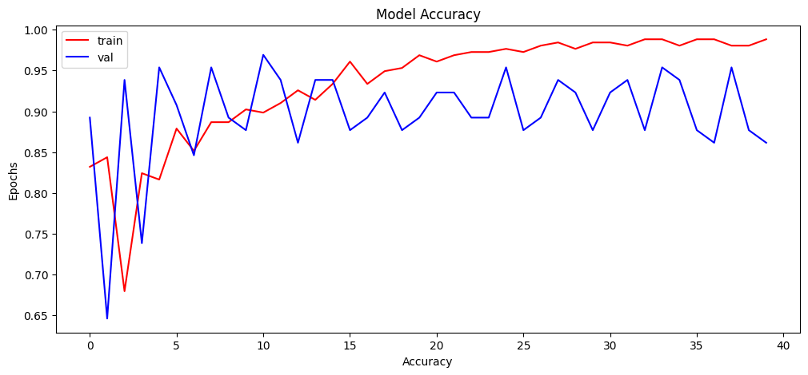
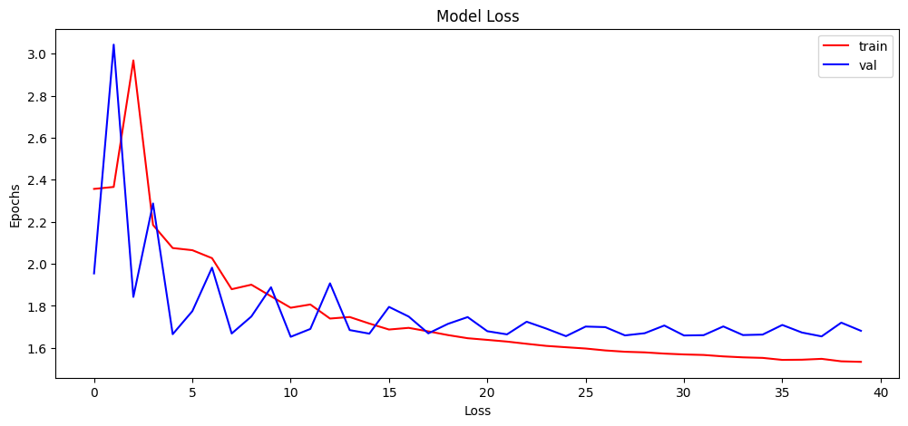
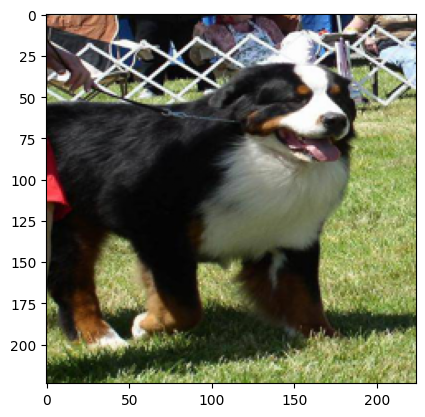

# Dog_Breed_Prediction:
### Dog breed prediction is a machine learning task that involves training a model to identify the breed of a dog from an image or a set of images. This task can be challenging due to the large number of dog breeds and the high degree of variation within breeds.

## Steps for Import Dataset:
* #### In this project, we will see how to use Keras and TensorFlow to build, train, and test a Convolutional Neural Network capable of identifying the breed of a dog in a supplied image. This is a supervised learning problem, specifically a multiclass classification problem.
* #### We will start by connecting to Kaggle using Kaggle API which can be downloaded from your Kaggle account's settings and uploading it here(upload box).
* #### Next we will install Kaggle API using pip installation.
* #### Setting up Kaggle using Kaggle API.
* #### To store the data we will create a new directory and make it as current working directory.
* #### Searching Kaggle for the required dataset using search option(-s) with title 'dogbreedidfromcomp'. We can also use different search options like searching competitions, notebooks, kernels, datasets, etc.
* #### After searching the data next step would be downloading the data into collab notebook using references found in search option.
* #### We will unzip the data which is downloaded and remove the irrelevant files. 
## Importing Necessary Libraries:
* #### Importing required libraries.
* #### Loading the labels data into dataframe and viewing it. Here we analysed that labels contains 10222 rows and 2 columns.  
* #### We will work on only 3 breeds due to limited computational power. You can consider more classes as per your system computational power.
## Encode categorical data:
* #### As we are working with the classification dataset first we need to one hot encode the target value i.e. the classes. After that we will read images and convert them into numpy array and finally normalizing the array.
## Building Model(Sequential Model):
* #### After defining the network architecture we found out the total parameters as 162,619.
* #### After defining the network architecture we will start with splitting the test and train data then dividing train data in train and validation data. 
* #### Now we will train our model on 100 epochs and a batch size of 128. You can try using more number of epochs to increase accuracy. During each epochs we can see how the model is performing by viewing the training and validation accuracy.

# Conclusion:
#### We started with downloading the dataset creating the model and finding out the predictions using the model. We can optimize different hyper parameters in order to tune this model for a higher accuracy. This model can be used to predict different breeds of dogs which can be further used by different NGO's working on saving animals and for educational purposes also.
## ScreenShorts:

